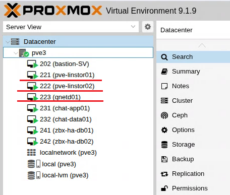
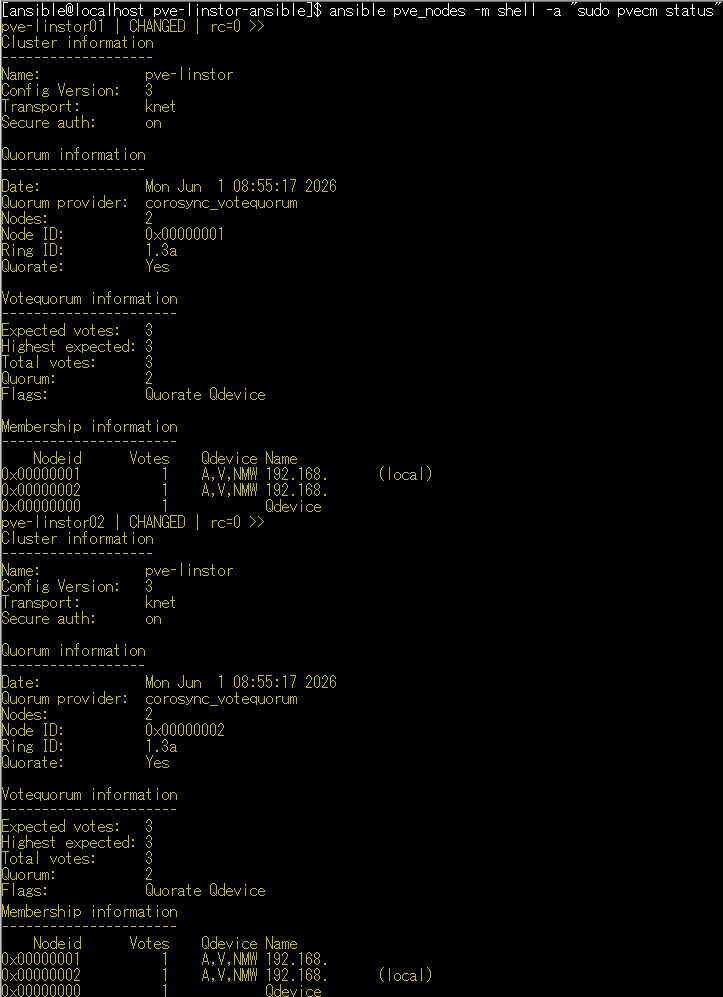
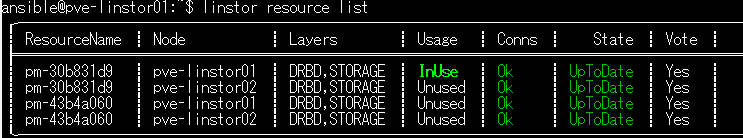
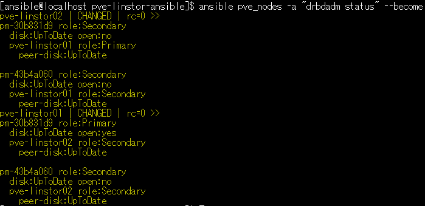
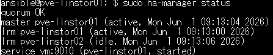
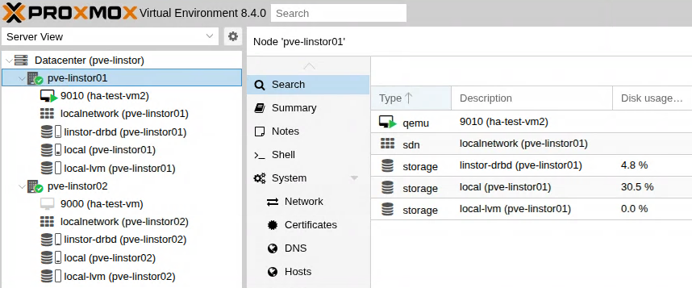

# Proxmox VE LINSTOR Ansible Lab

Ansible portfolio project for building a Proxmox VE two-node lab environment with LINSTOR, DRBD-backed storage, QDevice quorum support, and HA verification.

This project is intended for infrastructure learning, storage clustering practice, and validation of Proxmox VE high availability workflows using Infrastructure as Code.

## Overview

This playbook automates the setup of a Proxmox VE lab environment using Ansible.

The lab is designed to verify a two-node Proxmox VE cluster with LINSTOR/DRBD storage and an additional QDevice node for quorum support.

The main purpose of this project is to demonstrate:

- Proxmox VE cluster automation
- LINSTOR and DRBD-backed shared storage configuration
- QDevice-based quorum support
- Proxmox VE HA resource verification
- VM disk placement on LINSTOR-backed storage
- Infrastructure automation using Ansible roles

## Architecture

```text
Ansible Control Node
        |
        | SSH
        |
        +-----------------------+
        |                       |
Proxmox VE Node 1         Proxmox VE Node 2
pve-linstor01            pve-linstor02
        |                       |
        |                       |
        +------ LINSTOR / DRBD -+
        |
        |
QDevice / QNetd Node
qnetd01
```

## Lab Nodes
| Role | Hostname  | Example IP |
|---|---|---|
| Proxmox VE node 1 | pve-linstor01 | 192.168.56.221 |
| Proxmox VE node 2 | pve-linstor02 | 192.168.56.222 |
| QDevice node | qnetd01 | 192.168.56.223 |

## Main Components
- Proxmox VE
- LINSTOR
- DRBD
- QDevice / QNetd
- Proxmox VE HA Manager
- Ansible
- LINBIT repository
- LINSTOR-backed Proxmox VE storage

## Main Features
- Proxmox VE repository configuration
- LINBIT repository configuration
- LINSTOR package installation
- LINSTOR controller / satellite setup
- DRBD-backed storage configuration
- Proxmox VE cluster setup
- QDevice quorum support
- Proxmox VE storage integration
- Basic verification tasks
- Example inventory and variable files for public use

## Directory Structure
```text
pve-linstor-ansible/
├── ansible.cfg
├── inventory.ini.example
├── group_vars/
│   └── all.yml.example
├── roles/
│   ├── common/
│   ├── linbit_repo/
│   ├── linstor/
│   ├── linstor_cluster/
│   ├── linstor_storage/
│   ├── pve_cluster/
│   ├── pve_linstor_storage/
│   ├── pve_repo/
│   ├── qdevice/
│   └── verify/
└── site.yml
```

## Requirements
- Ansible control node
- Two Proxmox VE nodes
- One QDevice / QNetd node
- SSH access from the Ansible control node
- Sudo privileges for the Ansible user
- Network connectivity between all lab nodes
- Additional storage devices for DRBD/LINSTOR testing

## Usage

Copy the example inventory file:

cp inventory.ini.example inventory.ini

Copy the example variable file:

cp group_vars/all.yml.example group_vars/all.yml

Edit the files for your lab environment:

vi inventory.ini
vi group_vars/all.yml

Run syntax check:
```bash
ansible-playbook site.yml --syntax-check
```
Apply the playbook:
```bash
ansible-playbook site.yml
```
## Example Verification Commands

Check Proxmox VE cluster status:

pvecm status

Check Proxmox VE HA status:

ha-manager status

Check LINSTOR resources:

linstor resource list

Check DRBD status:

drbdadm status

Check Proxmox VE storage configuration:

pvesm status

## Screenshots / Verification

This section shows verification results for the Proxmox VE LINSTOR / DRBD lab environment.

For security reasons, IP addresses, hostnames, usernames, URLs, and environment-specific values may be masked in the screenshots.

### Proxmox VE Cluster GUI




This screenshot shows the Proxmox VE lab environment with the LINSTOR/DRBD cluster nodes and the QDevice node.

The lab consists of:

- pve-linstor01
- pve-linstor02
- qnetd01

### QDevice / Quorum Status



This verification shows the Proxmox VE cluster quorum status.

The output confirms:

- The cluster is quorate
- Two Proxmox VE nodes are configured
- QDevice is used for quorum support
- Expected votes and total votes are available

### LINSTOR Resource List



This verification shows LINSTOR-managed resources across the Proxmox VE nodes.

The output confirms:

- LINSTOR resources exist on both nodes
- DRBD/STORAGE layers are used
- Resource connections are healthy
- Resource state is UpToDate

### DRBD Status



This verification shows DRBD replication status.

The output confirms:

- Primary / Secondary role assignment
- UpToDate disk status
- UpToDate peer disk status
- DRBD-backed storage replication between nodes

### Proxmox VE HA Manager Status



This verification shows the Proxmox VE HA manager status.

The output confirms:

- Cluster quorum is OK
- HA manager is active
- A test VM is managed as an HA service
- The HA service is started on a Proxmox VE node

### Proxmox VE LINSTOR Storage Integration



This screenshot shows LINSTOR-backed storage integrated into the Proxmox VE environment.

The storage view confirms that linstor-drbd is available as a Proxmox VE storage backend and can be used for VM disk placement.

### Auto Failover Demo Video

A recorded auto failover demo video is available below.

For security reasons, IP addresses, hostnames, URLs, and environment-specific values may be masked in the video.

[Watch LINSTOR auto failover demo video](https://drive.google.com/file/d/1UVUVvpr2-nspy3vzeXHvu2HdyvKpbeK-/view?usp=sharing)

The demo verifies:

- Proxmox VE HA service behavior
- VM restart or failover handling
- LINSTOR / DRBD-backed storage availability
- DRBD Primary / Secondary role behavior
- Cluster quorum status during the verification

## Security Notes

Do not publish real environment values.

Before publishing this repository, make sure the following information is not included:

- Real IP addresses
- Real hostnames
- Passwords
- API tokens
- SSH private keys
- Vault password files
- Internal domain names
- Customer or company confidential information

Use example values such as:

192.168.56.0/24
example.local
CHANGE_ME

## Notes

This project is for lab and validation use.

Additional design, hardening, fencing, quorum, storage redundancy, and operational review are required for production use.
